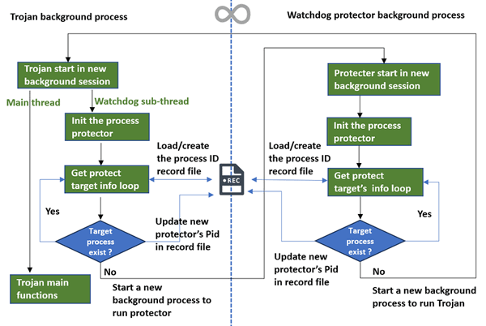
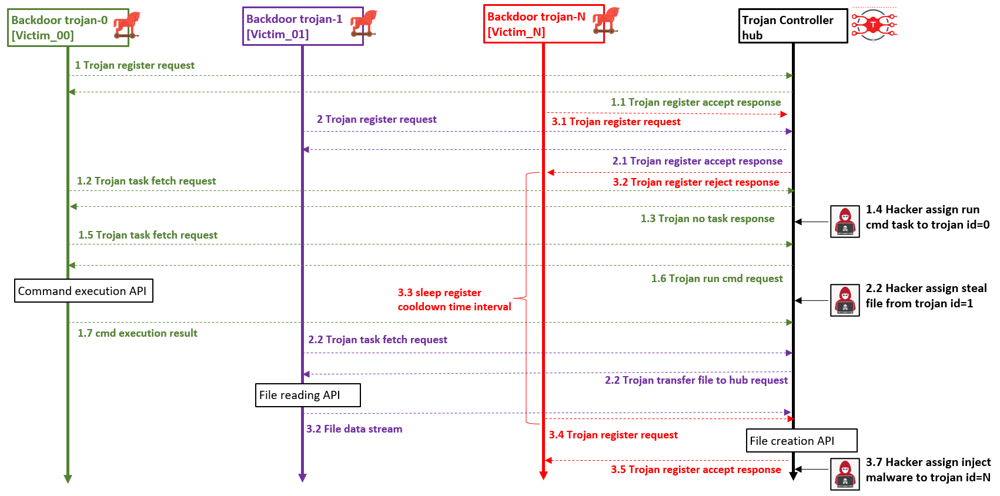
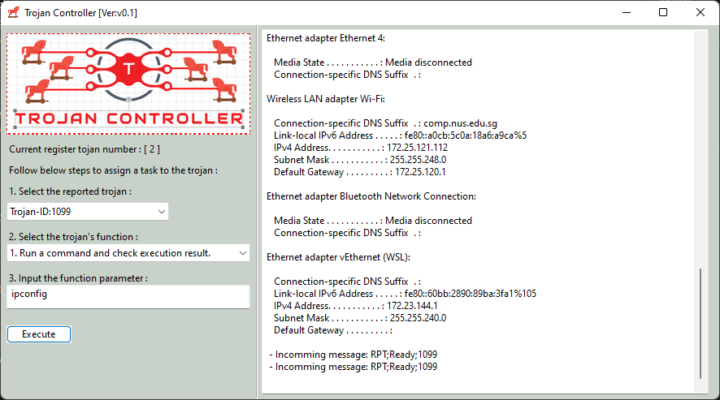

# Backdoor Trojan System

We want to build a Backdoor trojan system which contents a watch dog protected backdoor trojan, a peer to peer single trojan controller and a multiple trojans control hub system for below purpose :

1. **Education** at any level of cyber security course about trojan or the course lab assignment / demo. 
2. **Training** for company employees, semi-professionals about the trojan attack and defense workshop. 
3. **Development or cluster management** for cluster admin to remote manage cloud computing infra (with out using credentials ).
4. **Testing** for the security solution program / malware detection program to detect the trojan.
5. **Research** in cluster network unusual/exception traffic detection, trojan detection, risk respond,  penetration action detection.

[TOC]

------

### Introduction

The Trojan system contents 3 main programs:

1. One **Backdoor Trojan** program running on victim open a backdoor to allow hacker to remote run commands, steal credential files, do harmful action to the host computer or  insert other malware on a host without authorization. 
2. One **P2p Trojan Connector**  which is a console based peer to peer direct trojan remote connector for hacker used to remote control one of the backdoor trojan to do the harmful action such as rename all user's file, full fill user's home folder with garbage files. It allows multiple hackers to control one trojan at the same time. 
3. One **Trojans Controller Hub** which is a UI based trojan management hub used for hacker to manage multiple trojan in different victim host or batch launch attack such as clear all files in every victim computer's home folder. It allows one hacker control multiple trojans at the same time.

The system relation diagram is shown below:

`version v0.1.2`

------

### Program Design

The Backdoor Trojan, P2p Trojan Connector, Trojans Controller Hub will follow below design

#### Backdoor Trojan

The backdoor trojan program contents four main parts: 

- A process watch dog protector to protect itself to avoid user stop the trojan by killing its process. 
- A function actor implement detailed hacker's tasks such as run command, execute harmful action, do files transfer and malware injection, log user's keyboard input.
- A UDP server to handle the remote control request from Trojan connector and send back the tasks execute result. 
- A UDP client to report to Trojan control hub,  pull down the tasks assigned to it from the hub and report the tasks execution result back to hub.

The backdoor trojan will be under "silent mode" before a hacker uses valid active code to active the trojan, : before active the trojan will not response to any request to the victim machine, so the network security people will not find the backdoor service if they Nmap scan the victim’s network service. 

The backdoor trojan program work flow is shown below:

The backdoor trojan is a multi-process program with multiple threads running parallel, these are the four thread detail:

1. Program main thread : the main thread will call the task manager to call different task handling API to finish the harmful tasks.
2. Watchdog thread : A thread to check the new started watchdog's execution. 
3. Task receiver thread : A thread with UDP server to accept the trojan connector's request, put the task in the queue and send the task execution result back to the hacker. 
4. Trojan reporter thread: A thread with UDP client to register the trojan to the trojan control hub, fetch the task regularly from the hub, then update the task execution result to the trojan controller hub.

##### Watch dog process

The watchdog will start a in an individual process to run the watchdog program (watchdog A), the backdoor trojan itself will also start a watchdog thread (watchdog B) to regularly check the watch dog program A's execution, if the watch dog program is killed, it will start a new watch dog. The watchdog protector will do the same thing for the trojan (if the watchdog detected the trojan is killed, the will restart the trojan), so these 2 program will make a protection deadlock loop as shown below: 

Unless the user can find the two malware and kill their processes at the same time, otherwise he can now stop the trojan running by kill the trojan process.

#### Trojan Connector

The P2P Trojan connector is a console based peer to peer direct connection program for hacker to remote control one of the backdoor trojan to do the harmful action such as rename all user's file,  files full fill user's home folder use garbage and inject other malware in to the victim... It supports multiple hackers work together to control one trojan. As it needs to send the handshake to the target trojan, so the connector need to be in the same subnet of the victim host (If there is no additional routing rule) .

The Trojan and multiple trojan connector timing UML diagram is shown below:

As the tasks execution is single thread, if the trojan is running a task, the new incoming tasks request will be put the in the tasks queue. When the hacker is run the connector at the 1st time, he needs to type in a valid active code, then he can select the harmful action he wants the trojan do : 

The function 5 & 6 is under development, we will make then online at version v0.1.3.

#### Trojans Controller Hub

Trojans Controller Hub allows one hacker control multiple trojans, it will provide UI management interface for hacker to manage multiple trojan in different victim hosts to batch launch attack such as clear all file in every victim computer's home folder. If a backdoor trojan's `report mode` flag is set to true, it will try to register itself to the Trojans Controller Hub regularly in low frequency. Once registration accepted, the trojan will repeat fetch task from the tasks from hub to execute under higher frequency. 

The Trojans and trojan controller hub timing UML diagram is shown below:

Trojan control hub UI view:

Run the windows cmd `ipconfig` on victim host which "Trojan-ID:1099".

------

#### Program Setup

###### Development Environment : python 3.7.4+

