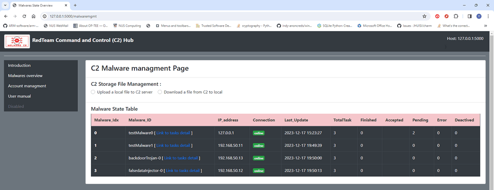
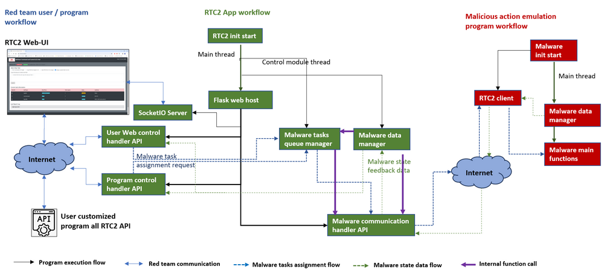
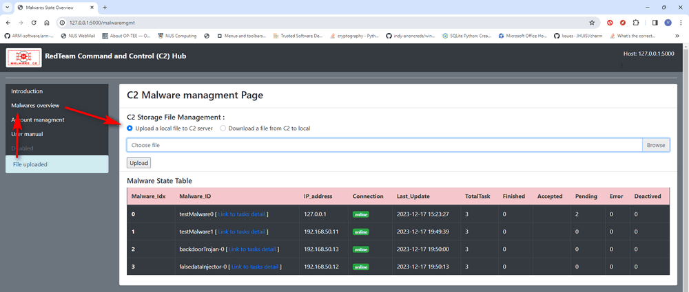
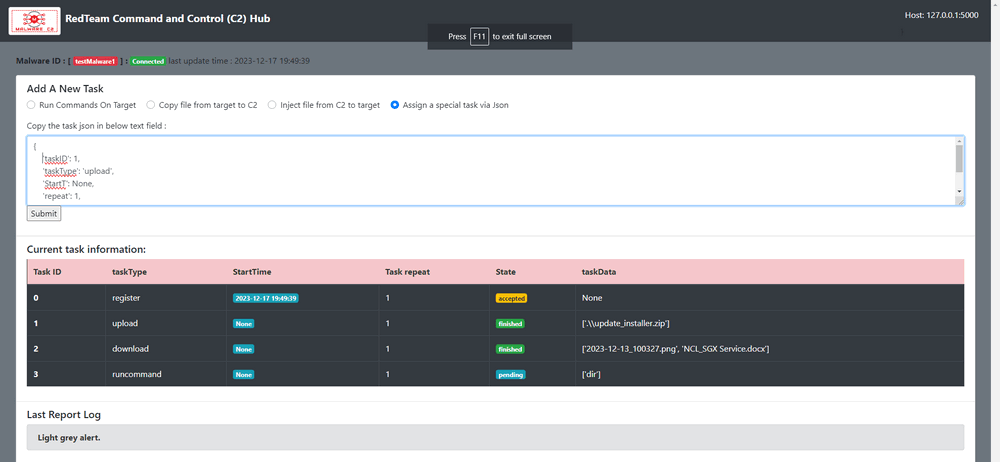

# Red Team C2 Emulator


**Project Design Purpose** : The Red Team Command and Control (RTC2) server, commonly known as a C&C server, plays a pivotal role in cyber exercises and ranges. It serves as a centralized hub that red team members use to control and communicate with simulated compromised victims. This command center enables red team members or attackers to seamlessly issue instructions to the compromised machines, collect data from them, and coordinate various malicious activities within the exercise program. Our goal is to offer a comprehensive C2 server emulation solution designed for cyber exercise red team members. This solution allows them to seamlessly integrate different probing programs and malicious action programs, providing dynamic monitoring, scheduling, and control capabilities. The versatility of our solution makes it applicable across a range of fields, offering a robust platform for enhancing cyber defense readiness and testing the resilience of security measures.

The system can be applied on below fields : 

**Cyber Exercise Red Team Malicious C2 Servers Simulation **

- **Botnet Control:** Cybercriminals use C2 servers to control networks of compromised computers (botnets) for various malicious activities, such as launching DDoS attacks, stealing sensitive information, spreading malware, and more.
- **Remote Control:** C2 servers provide attackers with a means to remotely issue commands to compromised systems, allowing them to manipulate and control the infected machines.

**Defensive C2 Frameworks **

- **Red Team Operations:** In the context of cybersecurity exercises, red teams (ethical hackers) may use C2 frameworks to simulate the tactics, techniques, and procedures (TTPs) of real-world adversaries. This helps organizations test their defenses and improve their incident response capabilities.
- **Training and Simulation:** Security professionals use C2 frameworks for training purposes, allowing them to understand and practice responding to simulated cyber threats in a controlled environment.

The RTC2 ( red team command and control ) system will provide a multi-threading based client which users can easily hook the client into their malicious action program to integrate in the RTC2 system.  The RTC2 server not only offers a robust back-end but also comes equipped with a user-friendly web interface and an HTTP request handler API. So the users to can remote control the integrated malware effortlessly—either through a web browser or their custom programs. This combination of adaptability and accessibility enhances the user experience, providing a versatile platform for managing and orchestrating their cyber exercise scenarios.

[TOC]

------

### Introduction 

Command and Control ( C2 ) servers are not inherently necessary or beneficial for legitimate and ethical purposes. However, there are situations in the realm of cybersecurity where the concept of command and control is used for defensive purposes, typically in the context of security operations and incident response. In these cases, organizations might employ C2 frameworks or systems to simulate the behavior of real-world attackers. These simulations help security professionals and organizations assess their ability to detect, respond to, and mitigate cyber threats. We want to provide a general "plug and play" red team C2 solution for : 

- **Cyber Exercise Red Teaming :** Utilized by red teams for the seamless control of simulated threats, including DDoS attacks simulator, data theft programs, and phishing data generators, providing a comprehensive toolset for enhancing defensive capabilities.
- **Forensic Traffic Research:** Designed to simulate and replicate attack scenarios, the C2 solution facilitates research and forensic analysis for C2 detection. This capability is instrumental in understanding and fortifying against potential cyber threats.

The overview work flow of the RTC2 is shown below : 


`version v2.1`

The RTC2 system contents two main parts **RTC2 Hub Server** and **RTC2 Client** : 

#### Red Team C2 Hub Server Introduction   

This web hosting program serves as a centralized control hub for managing various Red-Teaming- Malicious-Action-Programs and handling user requirements. The key functionalities include:

-  **Web-UI Task Assignment:** Users can employ the intuitive web interface to remotely assign diverse tasks to specific Malicious Action Programs. This includes executing commands on the victim, uploading files from the victim's machine, injecting other programs, or recording the victim's user actions.
- **File Transfer "Bridge":** The C2 Hub Server acts as a secure "bridge," facilitating the seamless transfer of files between the victim machine and the user's local folder without requiring additional authorization on the victim's end.
- **Web Dashboard Monitoring:** Users have access to a comprehensive web dashboard, allowing them to monitor the  execution state of Malicious Action Programs on the victim machines.
- **Web-API Automation:** For streamlined control, users and their programs can leverage the web API to automate the control of all linked Malicious Action Programs within the C2 framework. This ensures a dynamic and responsive environment for managing and orchestrating red team operations effectively.

The Red-Teaming- Malicious-Action-Programs management page is shown below : 



`version v2.1`

The Red-Teaming- Malicious-Action-Program's tasks management page is shown below : 


`version v2.1`

#### RTC2 Client 

The RTC2 client is a multi-threading based client which user can hook it to their Red-Teaming-Malicious-Action-Programs to communicate with the C2 Hub Server. The key functionalities include:

- **Parallel Execution :** Running in parallel with the main thread of the Red-Teaming-Malicious-Action-Program, the RTC2 Client regularly reports the program's state and task execution results to the RTC2 Hub Server. This ensures real-time updates and streamlined coordination.
- **Task Assignment:** The RTC2 Client fetches detailed tasks assigned by the RTC2 Hub, facilitating the execution of related functions within the Red-Teaming-Malicious-Action-Program. This dynamic interaction enhances the adaptability of the client in responding to varied tasks.
- **File/Data Handling:** The client adeptly manages file and data translation requests from the RTC2 Hub, ensuring seamless and secure communication. This functionality ensures efficient and secure transfer of information between the Red-Teaming-Malicious-Action-Program and the C2 Hub Server.


------

### Program Design

We have used the Python-Flask framework to construct our web hosting platform, offering a robust foundation for users. The system provides a multi-threading API handling function, enabling concurrent utilization by multiple users to control multiple Red-Teaming-Malicious-Action-Program simultaneously. The system workflow is delineated below:



`version v2.1`

#### RTC2 Web Service API Design 

The RTC2 Web Service offers three distinct HTTP/HTTPS APIs designed to accommodate various requests:

1. **User Web Control API:** This API delivers a diverse user interface, empowering users to assign tasks to malware seamlessly. It includes multiple dashboards tailored for red team users, facilitating the monitoring of Red-Teaming-Malicious-Action-Program states and detailed execution tasks.
2. **Program Control API:** For enhanced flexibility, we provide an HTTP-POST interface, enabling red team users to automate the control of all functions accessible through the Web Control API. This feature allows users to seamlessly integrate their programs with RTC2, streamlining the execution of tasks.
3. **Malware Communication API:** Specifically designed to handle communication from RTC2 clients connected to Red-Teaming-Malicious-Action-Program, this API manages data retrieval, task assignment, and file transfers. It serves as a robust bridge for effective communication and coordination between the RTC2 server and the hooked Red-Teaming-Malicious-Action-Programs.

#### Data Manager Functionality 

The Data Manager serves as the central "database," meticulously storing comprehensive information about each registered Malicious Action Program. This includes a unique malware ID, victim IP address, task details, and intricate information for every task—such as `taskID`, `taskType`, `startTime`, `task repeat times`, `wait time before execution`, `task config parameters`, `task state,` and `task result`.

Upon red team members accessing the Red-Teaming-Malicious-Action-Program management web page, the Data Manager dynamically generates a malware state summary report. Furthermore, when navigating to the Red-Teaming-Malicious-Action-Program tasks page, the Data Manager retrieves and presents the malware's task summary report, enhancing visibility and control.

Upon the registration of a Malicious Action Program with the RTC2-Hub, the Data Manager receives and stores all re-configured task information. As an illustration, consider the example of a task where the Malicious Action Program is configured to upload a zipped file to the C2 server :

```
{	
	'taskID': 1,
    'taskType': 'upload',
    'startT': None,		# None means start immediatly if recevied 
    'repeat': 1,		# how many times to repeat the task.
    'exePreT': 0,		# time to wait before execution
    'taskData': [os.path.join(dirpath, "update_installer.zip")]
}
```

 

#### Malware Task Queue Manager 

The Malware Task Queue Manager plays a crucial role in RTC2, ensuring synchronization between tasks and the associated Malicious Action Programs while handling user-initiated task adjustments. This guarantees that the task queue of each Malicious Action Program aligns seamlessly with the RTC2 database. 

The following detailed steps outline the process when a user sets a task to request the C2 to upload a file:

1. A red team user initiates the task by specifying the upload file name through the web or program control API for Malicious Action Program-1.
2. The Task Queue Manager receives the request, generates detailed information for the file upload task, and enqueues it into Malicious Action Program-1's task queue.
3. Upon reporting to the RTC2-Hub, the Task Queue Manager dequeues the file upload task and transmits the task information to Malicious Action Program-1.
4. Malicious Action Program-1 enqueues the file upload task into its own task queue.
5. During the next execution of Malicious Action Program-1's task function, the program uploads the specified file to the RTC2-Hub.
6. The uploaded file is processed, and the Task Queue Manager updates the Data Manager's task record to reflect the completion of the task.

For each task displayed on the tasks dashboard, it will be under below five states : 

- **Task pending** : Task is enqueued in the RTC2-Hub task manager's sending queue. 
- **Task accepted** : Task information has been sent to related the Red-Teaming-Malicious-Action-Program. 
- **Task finished** : Task execution finished and state updated in the RTC2-Hub. 
- **Task deactivated** : Task is disabled in the Red-Teaming-Malicious-Action-Program. 
- **Task Error** : Tasks execution got error. 


------

### Program Setup


------

### Program Usage 

##### Upload File to RTC2-Hub Storage from Red Team User Local Machine

- **Via RTC2-hub webpage : ** Main page => Malware management page [`http://127.0.0.1:5000/malwaremgmt`] => C2 File Storage Management => Upload a local file to C2 server. ( as shown below )



- **Via HTTP POST request** : 

```
http://<RTC2-Hub ip address >:<port>/fileupload, files={'file': (<filename>, fh.read())}
```


##### Download File From RTC2-Hub Storage to Red Team User Local Machine

- **Via RTC2-hub webpage : **Main page => Malware management page [`http://127.0.0.1:5000/malwaremgmt`] => C2 File Storage Management => Download a file from C2 to local => select the file from dropdown menu => click the download button. ( as shown below )


- **Via HTTP POST request** : 

```
http://<RTC2-Hub ip address >:<port>/filedownload, json={"filename": filename}
```


##### Assign Command Execution Task to Malicious-Action-Program

- **Via RTC2-hub webpage : ** Malware management page => related task detail dashboard link => Run Commands On Target =>Input the command string => click submit button to assign the task to the Malicious-action-program.  ( as shown below )


When the task finished, the command execution result will be shown in the `Last Report Log` area. 

- **Via HTTP POST request** : 

```
http://<RTC2-Hub ip address >:<port>/addcommand, json={"malwareID": <ID>, "commandData": <commandstr> }
```


##### Copy File From the C=Victim Machine to RTC2-Hub

- **Via RTC2-hub webpage : ** Malware management page => related task detail dashboard link => Copy file from target to C2 => Input file path in victim machine => click submit button to assign the task to the  Malicious-action-program


Then the specified file will be uploaded via C2-client to the C2Hub's upload folder.

- **Via HTTP POST request** : 

```
http://<RTC2-Hub ip address >:<port>/addfilecopy, json={"malwareID": <ID>, "filepath": <filepath in victim machine> }
```


##### Inject file from C2 to target victim machine 

- **Via RTC2-hub webpage : ** Malware management page => related task detail dashboard link => Inject file from C2 to target  => Select the inject file from the dropdown menu => click submit button to assign the task to the  Malicious-action-program


The the specified file will be download to the victim machine  via C2-client's configured download folder.

- **Via HTTP POST request** : 

```
http://<RTC2-Hub ip address >:<port>/addfileinject, json={"malwareID": <ID>, "filename": <file name need to inject to victim> }
```


##### Assign Special Task to Malicious-Action-Program 

- **Via RTC2-hub webpage : ** Malware management page => related task detail dashboard link => Assign a special task via Json  => Copy the task json in below text field  => click submit button to assign the task to the Malicious-action-program. 



The task json contents will follow the task define json format as below example : 

```
{	
	'taskID': 1,
    'taskType': 'upload',
    'startT': None,
    'repeat': 1,
    'exePreT': 0,
    'taskData': [os.path.join(dirpath, "update_installer.zip")]
}
```

- **Via HTTP POST request** : 

```
http://<RTC2-Hub ip address >:<port>/addnewtask, json={"malwareID": <ID>, "taskdata": <task detail infomration json data> }
```


------

>  Last edit by LiuYuancheng (liu_yuan_cheng@hotmail.com) at 10/12/2023, if you have any problem please free to message me.