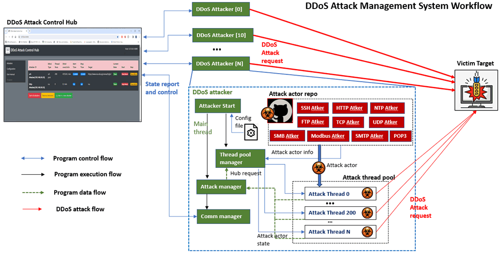

## DDoS Attack Management System

The distributed denial-of-service (DDoS) attack is a malicious attempt to disrupt the normal traffic of a targeted server, service or network by overwhelming the target or its surrounding infrastructure with a flood of Internet traffic. It is a very common and simple attack vector which hacker will use to compromise a web / network service. We want to create a multi-thread service / App layer DDoS Attack emulation system for user which can parallel generate hundreds of network request (such as ssh, http get/post, udp, tcp, modbus ) at same time and send to one target. The DDoS attack manager can be applied for below purpose : 

1. **Education and Training** : used for any level of cyber security course about DDoS attack or the related course lab assignment / demo. 
2. **Stress testing or penetration test : **Used for different kind of network service. 
3. **Attack simulation** : used for red team to launch DDoS attack in cyber exercise. 
4. **Research** : used for DDoS attack research such as attack identify, detection and defense. 

[TOC]

------

### Introduction 

DDoS attacks achieve effectiveness by utilizing multiple compromised computer systems as sources of attack traffic. Exploited machines can include computers and other networked resources such as [IoT devices](https://www.cloudflare.com/learning/ddos/glossary/internet-of-things-iot/). We want to create a distributed DDoS attack launch system which contents one DDoS attack actor repository, several DDoS attacker and one attack control hub.

1. One **DDoS attacker** program running on single nodes with a attack thread pool to start several hundreds of parallel threads to implement the attack at the same time based on user config. Currently we provide 10 different categories service attack actors and user can also easily plug their customized attack program in the attacker. 
2. One **DDoS attack actors** repo contents different kinds of attack actor to send different kinds of network request (such ssh, https-GET, https-POST, SMB login...) to the target. Each attack actor object will be assembled in a attack thread and put in to the attack pool of the DDoS attacker. 
3. One **DDos control hub** to link all the DDoS attackers together so the user can monitor the current attack state and control each DDoS attack via the hub's web interface. 

------

### System design

The DDoS attack management system work flow is shown below : 

Version `v1.0.2`

#### DDoS Attacker

The DDoS attacker is the main program running on each node to implement the DDoS attack, the user can config the attack thread number, attack start/stop time. The attacker will have a thread pool, each attack actor need to be assembled in a attack thread then running parallel. 

|      | time   |             |             |       |
| ---- | ------ | ----------- | ----------- | ----- |
| t0   | 161019 | 88203085    |             | 7456  |
| t1   | 161148 | 359,577,552 | 159,577,552 | 11673 |
| t2   | 161250 | 698418446   | 150,423,062 | 15919 |
|      | 161352 | 948841508   | 134,258,015 | 19967 |
|      | 161424 | 1083099523  | 160,475,639 | 14334 |
|      | 161503 | 1243575162  | 130,293,332 | 15129 |
|      | 161604 | 1488050220  |             |       |

------

Use cases

