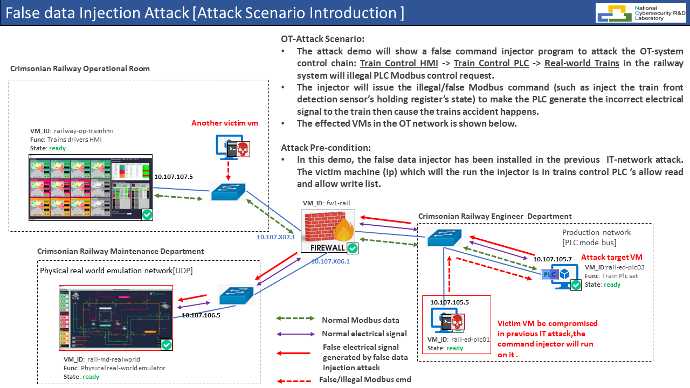
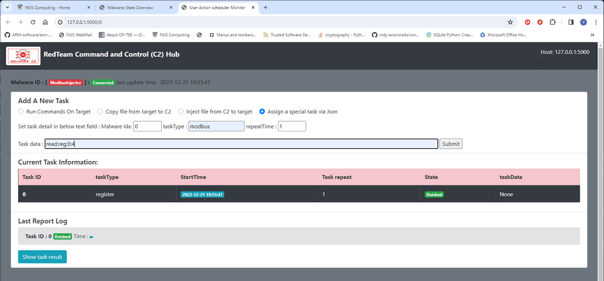
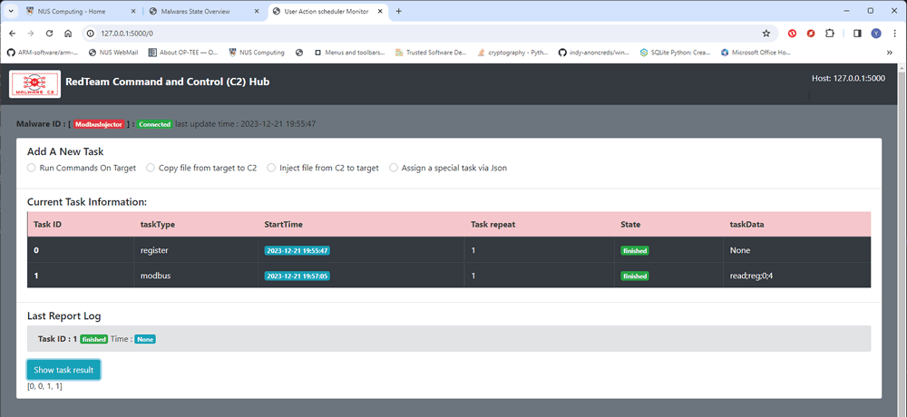
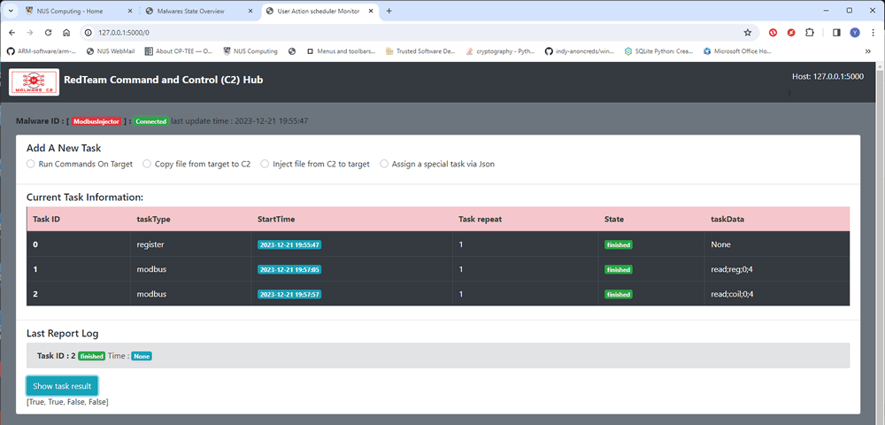
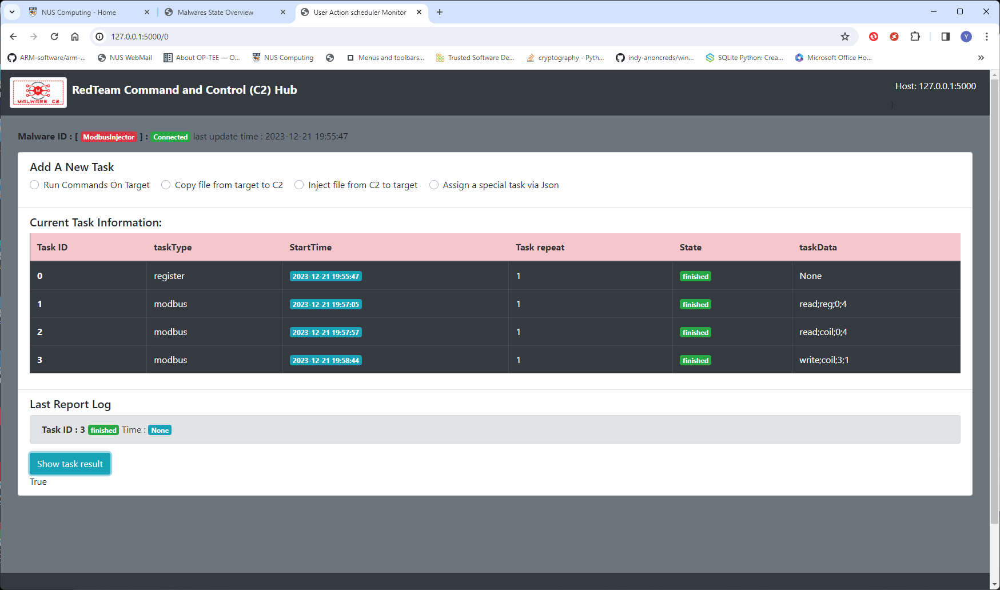

# False Modbus Command Injector

**Program design purpose :** We want to create a false command injection program which can be integrated in our C2 Emulation system and keep sending the Modbus cmd to attack a PLC or other Modbus-TCP protocol based OT-device. This program will be used for the Cross Sward 2023 railway system attack demo.

[TOC]

**Table of Contents**

- [False Modbus Command Injector](#false-modbus-command-injector)
    + [Introduction](#introduction)
      - [OT-Attack Scenario Introduction](#ot-attack-scenario-introduction)
      - [Attack Background Knowledge Introduction](#attack-background-knowledge-introduction)
      - [Attack Detail Introduction](#attack-detail-introduction)
    + [Program Setup](#program-setup)
    + [Program Usage](#program-usage)
      - [Example to inject different kind of false data](#example-to-inject-different-kind-of-false-data)
        * [1. Read Holding Register State](#1-read-holding-register-state)
        * [2.Read Output Coils State](#2read-output-coils-state)
        * [3.Change One Output Coils State](#3change-one-output-coils-state)
      - [Injection Data Table](#injection-data-table)
      - [Problem and Solution](#problem-and-solution)

------

### Introduction 

This Modbus data injector malware is modified from the backdoor trojan program <backdoorTrojan.py> by adding the plc-Modbus communication module so the C2 system can remote control it and use it to launch the false command injection attack to the XS2023 railway system `Train Control PLCs (PCL07/08)` remotely.

#### OT-Attack Scenario Introduction 

- The attack demo will show a false command injector program to attack the OT-system control chain: `Train Control HM` -> `Train Control PLC` -> `Real-world Trains in the railway system` will illegal PLC Modbus control request. 
- The injector will issue the illegal/false Modbus command (such as inject the train front detection sensor’s holding register’s state) to make the PLC generate the incorrect electrical signal to the train then cause the trains accident happens.
- The effected VMs in the OT network is shown below.



#### Attack Background Knowledge Introduction 

The train sensor control logic is shown below, the attack will try to break the train safety check. 


#### Attack Detail Introduction 

The attack malware (injector) need to repeat injecting at less 3 commands in two trains PLCs under the frequency which higher than trains operator.

- Keep sending power cut off command to the front train (ccline-0) to make it stop.
- Keep send full throttle command to behind train (ccline-1) to make it rush to the front train (ccline-0) . 
- To avoid the behind train (ccline-1) collision detection sensor trigger train break, keep injecting the detection sensor clear cmd (holding register val=0, front safe) to ccline-1 PLC. 


------

### Program Setup

To setup the false data injection program please refer to victim vm's ansible readme file: 

https://github.com/LiuYuancheng/Cross-Sword-2023-Nato-Event/blob/main/ansibleVM/railway-op-victim/Readme.md

Development/Execution Environment : python 3.7.4+

Additional Lib/Software Need : 

```
pyModbusTCP==0.2.1
requests==2.28.1
```

Program Files List

| Program File                     | Execution Env | Description                                     |
| -------------------------------- | ------------- | ----------------------------------------------- |
| falsecmdinjector.py              | python 3      | Main false command injection program.           |
| ConfigLoader.py                  | python 3      | lib file : Configuration file loader            |
| modbusTcpCom.py                  | python 3      | lib file:  PLC-Modbus TCP communication module. |
| c2Client.py                      | python 3      | lib file : C2 server communication file         |
| c2MwUtils.py                     | python 3      | lib file : malware data storage module          |
| falseCmdInjectorCfg_template.txt |               | config file                                     |


------

### Program Usage

Set the config file base on your C2 server and PLC setting : 

```
# This is the config file template for the module <falseCmdInjector.py>
# Setup the paramter with below format (every line follows <key>:<val> format, the
# key can not be changed):

# Define the malware own info
OWN_ID:ModbusInjector
# Change this line to 10.107.{{ team_nr }}07.5 during the event.
OWN_IP:192.168.50.12

# Init the C2 IP address
# Change this line to 10.106.{{ team_nr }}07.11 during the event.
C2_IP:127.0.0.1
C2_PORT:5000
# The interval to report to C2
C2_RPT_INV:5

# Init the target PLC IP address
# Change this line to 10.106.{{ team_nr }}07.3/4/5 during the event.
PLC_IP:127.0.0.1
PLC_PORT:502
```

Run the false data injector to connect to the C2 server: 

```
python falsecmdinjector.py
```

Check whether the false data injector registered on C2:


#### Example to inject different kind of false data

##### 1. Read Holding Register State

Select the false Modbus data injector page, then select the **Assign a special task via Json**, then fill in the task detail : 

- TaskType: `modbus`
- Repeat: `int <number of the injection repeat times>`
- Tasks data: `read;reg;<start Holding register index>;<offset>`



Press the `submit` button, when the false data injector report the task finished, check the result by click the `Show task result` button : 




##### 2.Read Output Coils State

Select the false Modbus data injector page, then select the **Assign a special task via json**, then fill in the task detail: 

- TaskType: `modbus`
- Repeat: `int <number of the injection repeat times>`
- Tasks data: `read;coil;<start coil index>;<offset>`




##### 3.Change One Output Coils State 

Select the false Modbus data injector page, then select the **Assign a special task via json**, then fill in the task detail: 

- TaskType: `modbus`
- Repeat: `int <number of the injection repeat times>`
- Tasks data: `write;coil;<coil index>;<state value>`


Press the `submit` button, when the false data injector report the task finished, check the result by click the `Show task result` button : 




#### Injection Data Table

The inject data will follow the format `<Action key>;<Target key>;<parameter1>;<paramter2>`

| Action                      | Action key | Target key | parm1                  | parm2          |
| --------------------------- | ---------- | ---------- | ---------------------- | -------------- |
| Read holding registers      | read       | reg        | Register start address | address offset |
| Overwrite holding registers | write      | reg        | Register address       | value (0/1)    |
| Read coils state            | read       | coil       | Coil start address     | address offset |
| Overwrite coils state       | write      | coil       | Coil address           | value (0/1)    |


------

#### Problem and Solution

Refer to `doc/ProblemAndSolution.md`


------

> Last edit by LiuYuancheng(liu_yuan_cheng@hotmail.com) at 20/12/2023, if you have any problem, please send me a message.  Copyright (c) 2023 LiuYuancheng